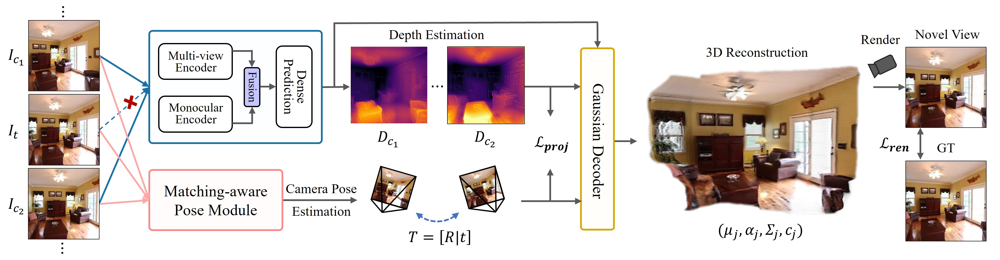

<p align="center">
  <h1 align="center">SelfSplat: Pose-Free and 3D Prior-Free Generalizable 3D Gaussian Splatting</h1>
  <p align="center">
    <a href="https://github.com/Gynjn">Gyeongjin Kang</a>
    ·
    <a href="https://github.com/Yoo-jisang">Jisang Yoo</a>
    ·
    <a href="https://github.com/Kanadae">Jihyeon Park</a>
    ·
    <a href="https://github.com/stnamjef">Seungtae Nam</a>
    ·
    <a href="https://github.com/Gynjn/selfsplat">Hyeonsoo Im</a> <br>
    ·
    <a href="https://github.com/Gynjn/selfsplat">Sangheon Shin</a>
    ·
    <a href="https://kuaicv.com/professor/?theme=pub/antoniau0026hide_banners=true">Sangpil Kim</a>
    ·
    <a href="https://silverbottlep.github.io/">Eunbyung Park</a>    
  </p>
  <h3 align="center"><a href="https://arxiv.org/abs/2411.17190">Paper</a> | <a href="https://gynjn.github.io/selfsplat/">Project Page</a> </h3>
  <div align="center"></div>
</p>

<p align="center">
  <a href="">
    
  </a>
</p>

<p align="center">
<strong>TL;DR: We present SelfSplat, enabling 3D reconstruction from unposed images without any 3D priors.</strong>
</p>

<p align="center">
  Supplementary materials will be released in a few days.
</p>

## Installation

To get started, create a virtual environment using Python 3.10:

```bash
conda create -n selfsplat python=3.10 -y
conda activate selfsplat
pip install torch torchvision --index-url https://download.pytorch.org/whl/cu118
pip install -r requirements.txt
```

### Install RoPE2D

```bash
cd src/model/encoder/croco/croco_backbone/curope
python setup.py build_ext --inplace
```

</details>

## Acquiring Pre-trained Checkpoints and Datasets

You can find pre-trained checkpoints [here](https://huggingface.co/lelady/SelfSplat/tree/main), and put then ub `pretrained` directory

For CroCo pretrained model, download from [here](https://github.com/naver/croco). Put `CroCo_V2_ViTLarge_BaseDecoder.pth` in `checkpoints` directory.

### RealEstate10K and ACID

Our Code uses the same training datasets as pixelSplat. Below we quote pixelSplat's [detailed instructions](https://github.com/dcharatan/pixelsplat?tab=readme-ov-file#acquiring-datasets) on getting datasets.

> pixelSplat was trained using versions of the RealEstate10k and ACID datasets that were split into ~100 MB chunks for use on server cluster file systems. Small subsets of the Real Estate 10k and ACID datasets in this format can be found [here](https://drive.google.com/drive/folders/1joiezNCyQK2BvWMnfwHJpm2V77c7iYGe?usp=sharing). To use them, simply unzip them into a newly created `datasets` folder in the project root directory.

> If you would like to convert downloaded versions of the Real Estate 10k and ACID datasets to our format, you can use the [scripts here](https://github.com/dcharatan/real_estate_10k_tools). Reach out to us (pixelSplat) if you want the full versions of our processed datasets, which are about 500 GB and 160 GB for Real Estate 10k and ACID respectively.

### DL3DV

For DL3DV dataset we follow the [DepthSplat](https://github.com/cvg/depthsplat/blob/main/DATASETS.md), it provides the detailed instruction on preparing DL3DV dataset. We only used 3K and 4K subset in training.

## Running the Code

### Training

The main entry point is `src/main.py`. Call it via:

```bash
python3 -m src.main +experiment=re10k
```

This configuration requires a single GPU with 80 GB of VRAM (A100 or H100). To reduce memory usage, you can change the batch size as follows:

```bash
python3 -m src.main +experiment=re10k data_loader.train.batch_size=1
```

Our code supports multi-GPU training. The above batch size is the per-GPU batch size.

### Evaluation

To render frames from an existing checkpoint, run the following:

```bash
# Real Estate 10k
python3 -m src.main +experiment=re10k mode=test checkpointing.load=pretrained/re10k.ckpt

# ACID
python3 -m src.main +experiment=acid mode=test checkpointing.load=pretrained/acid.ckpt

# DL3DV
python3 -m src.main +experiment=dl3dv mode=test checkpointing.load=pretrained/dl3dv.ckpt
```

## Camera Conventions

Our extrinsics are OpenCV-style camera-to-world matrices. This means that +Z is the camera look vector, +X is the camera right vector, and -Y is the camera up vector. Our intrinsics are normalized, meaning that the first row is divided by image width, and the second row is divided by image height.

## Contact
Contact [Gyeongjin Kang](mailto:ggggjin99@gmail.com) if you have any further questions.

## Citation

```
@misc{kang2024selfsplatposefree3dpriorfree,
      title={SelfSplat: Pose-Free and 3D Prior-Free Generalizable 3D Gaussian Splatting}, 
      author={Gyeongjin Kang and Jisang Yoo and Jihyeon Park and Seungtae Nam and Hyeonsoo Im and Shin sangheon and Sangpil Kim and Eunbyung Park},
      year={2024},
      eprint={2411.17190},
      archivePrefix={arXiv},
      primaryClass={cs.CV},
      url={https://arxiv.org/abs/2411.17190}, 
}
```

## Acknowledgements

This project is built on top of several outstanding repositories: [pixelSplat](https://github.com/dcharatan/pixelsplat), [MVSplat](https://github.com/donydchen/mvsplat), [DepthSplat](https://github.com/cvg/depthsplat), [PF3plat](https://github.com/cvlab-kaist/PF3plat), [CoPoNeRF](https://github.com/cvlab-kaist/CoPoNeRF), [CroCo](https://github.com/naver/croco), [UniMatch](https://github.com/autonomousvision/unimatch), and [gsplat](https://github.com/nerfstudio-project/gsplat). We thank the original authors for opensourcing their excellent work.